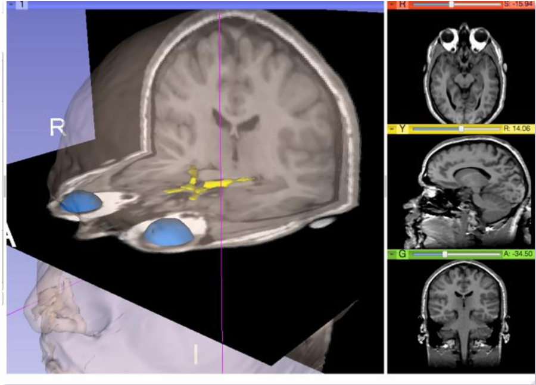
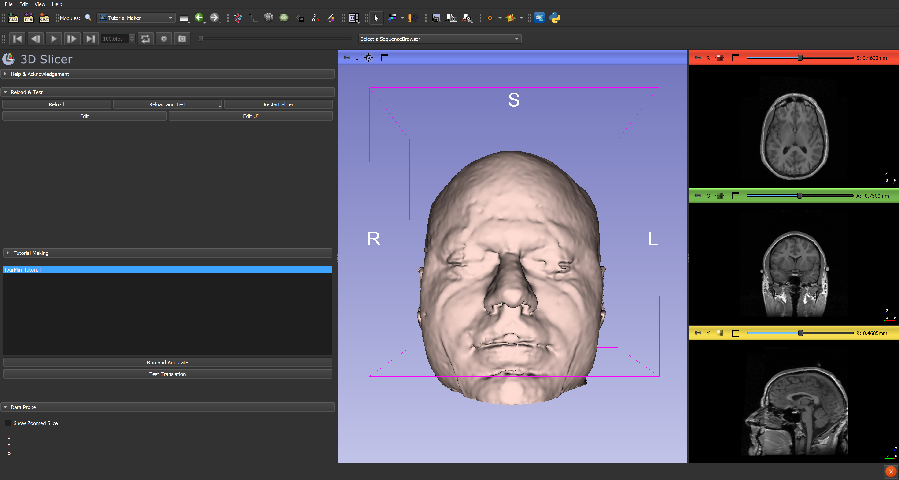
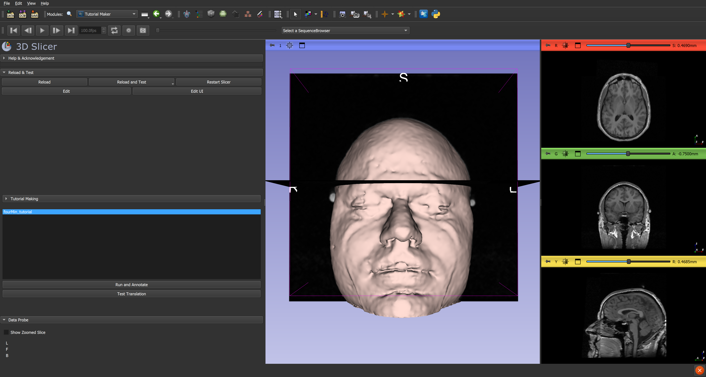

# Slicer Four-Minute Tutorial

Authors:
- Sonia Pujol, Ph.D., Surgical Planning Laboratory, Harvard Medical School
- Andras Lasso, Ph.D., PerkLab, Queen's University

Created from https://www.slicer.org/w/img_auth.php/a/ae/Slicer4minute-tutorial_SoniaPujol-mj.pdf

Description: This tutorial is a 4-minute introduction to the 3D visualization
capabilities of the Slicer4 software for medical image analysis.

<!-- Various illustrative images that are used in the markdown file is stored in Images folder. These images are not translated or processed in any way. -->

## Prerequisites

- 3D Slicer software: The Slicer4 software is available for download at http://download.slicer.org
- Download the slicer4minute-data.zip training dataset from http://wiki.slicer.org/slicerWiki/index.php/Training/4.0#Slicer4Minute_Tutorial

## Load data

Start 3D Slicer on your computer. The `Welcome` module is shown at startup by default.

<!-- If the caption of an image starts with "Screenshot" that indicates that it is a screenshot that needs translation. -->

> 3D Slicer Scene:
A Slicer scene is a MRML file which, contains the list of elements loaded into Slicer (volumes, models, fiducials, ...). The following example uses a 3D Scene, which contains images and 3D surface models of the head.

Select File -> Load Scene from the main menu, and load `slicer4minute.mrml`.

<!--
Annotations are stored in the image caption. Note that the same image can be reused multiple times, with different annotations in the same tutorial.
Also note standard Python syntax is used (dict objects in a tuple), which is flexible, relatively compact, and very easy to parse in Python.
-->

Slicer displays the elements of the slicer4minute scene, which contains the MR volume of
the brain and a series of 3D surface models.

Select Conventional Widescreen from the viewing mode menu.

Select Models from the Modules menu.

The Models module GUI displays the list of models loaded in the slicer4minute scene, their color and the value of their opacity (between 0.0 an 1.0).

Click on the pin icon on the top left corner of the red slice to display the slice viewer menu then click on the eye icon to display the axial slice in the 3D Viewer.

Use the slider of the red viewer to browse through the axial MR slices.
Slicer simultaneously displays the slices in the 3D viewer.

Lower the opacity of the Skin.vtk model in the Display tab.

The skull_bone.vtk model appears through the skin.

Position the mouse in the 3D viewer.
- Click the left-mouse button to drag and rotate the model.
- Click the right-mouse button to zoom in and out.

### Anatomical Views

Click on the pin icons in the top left corners of the red and green viewers to display the viewers' menu, and click on the eye icon to display the axial and coronal slice in
the 3D viewer.

Turn off the visibility of the skull bone to display the hemispheric white matter model.

The white matter surface, as well as the left and right optic nerves appear in the viewer.

Select the hemispheric_white_ matter.vtk model, and check Clip in the Display tab.

Use the slider of the coronal view (green) to expose the optic chiasm.

Increase the opacity of the skin model, and select the viewing mode 3D only.

Click on the Pin icon at the top left corner of the 3D viewer, and click on the Spin icon.

The 3D models and 2D anatomical slices start spinning in the 3D viewer.
Click a second time on the spin icon to stop the models from spinning.

## Summary

This tutorial was a short introduction to the 3D visualization capabilities of Slicer.
Visit the Slicer training compendium for more information on the software.

http://www.slicer.org/slicerWiki/index.php/Documentation/4.0/Training

## Acknowledgments

National Alliance for Medical
Image Computing
NIH U54EB005149

Neuroimage Analysis Center
NIH P41RR013218
